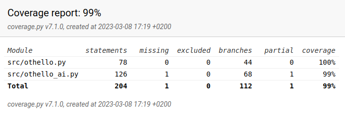
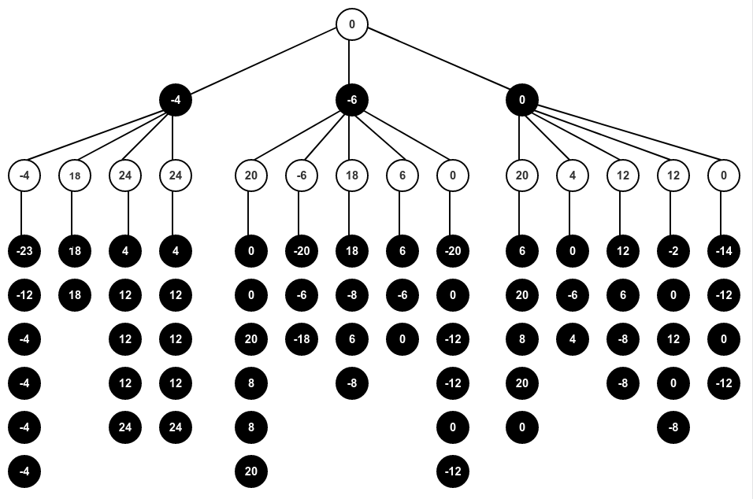

# Testausdokumentti

Sovelluksessa on tehty yksikkötestaus tiedostoista othello.py sekä othello_ai.py.
Niissä sijaitsevat pelin toteuttava luokka Othello ja tekoälyn toteuttava luokka OthelloAI.
Molempien käytössä on luokka PelilautaStub, josta haetaan testien käyttöön erilaisia pelilautoja eli pelitilanteita.
Pelilautojen ja mahdollisten siirtojen avulla testataan erilaisia skenaarioita
ja tutkitaan, toimivatko funktiot ennakoidulla tavalla.
Pelitilanteiden ei ole tarkoitus olla sinänsä realistisia vaan testata funktioita eri näkökulmista.

Luokka Othello on testattu ainakin haaraumakattavuuden suhteen kokonaisuudessaan. 
Testeissä on pyritty ottamaan huomioon erilaisia tilanteita, kuten
yhden tai useamman nappulan kääntämistä ja pelilaudan kulmapaikkojen läpikäyntiä.

OthelloAI:n testeissä on rakennettu pelitilanteita, joista odotetaan tiettyä tulosta minimax-algoritmilta.
Testeissä tutkitaan, valitseeko minimax seuraavien sääntöjen mukaan:

- voitto tappion sijaan
- voitto tasapelin sijaan
- nopeampi voitto eikä hitaampi voitto
- tasapeli tappion sijaan
- hitaampi voitto eikä nopeampi tappio
- paras heuristinen arvio, jos tilanteeseen ei liity voitto eikä tappio

Heuristisesta arviosta on testi, joka alkaa tilanteesta, jossa musta on tehnyt siirron c4.
Minimax tutkii pelitilanteita syvyydelle kolme asti ja valitsee niistä parhaan.
Tilanne on havainnollistettu ilman alfa-beeta-karsintaa alla olevassa kuvassa.
Ylimpänä on tekoälyn valitsema siirto, joka vastaa siirtoa e3,
eli pelilaudan koordinaatteina (2, 4). Alin rivi solmuja on aseteltu pystysuoraan, jotta ne mahtuisivat kuvaan.

Pelilaudan tilanteet ovat yksinkertaisia paitsi siksi, että niiden muodostaminen on haastavaa,
niin myös siksi, että niiden on hyvä olla suhteellisen helposti ihmisen todennettavissa.
PelilautaStubiin on kommentoitu siirtosarjoja tilanteiden lukemisen helpottamiseksi.

Testit pystyy ajamaan käyttöohjeessa kerrotulla komennolla, ja halutessaan voi luoda kattavuusraportin.
Kattavuusraporttia voi tarkastella myös painamalla codecov-merkkiä,
joka sijaitsee projektin GitHub-sivulla README-tiedoston yläosassa.
Joskus on tosin käynyt niinkin, että yhteyden muodostaminen ei onnistunut. 

