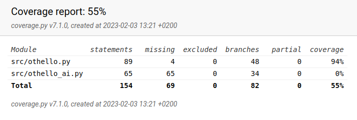

# Testausdokumentti

Sovelluksessa on tehty yksikkötestaus tiedostoista othello.py sekä othello_ai.py.
Niissä sijaitsevat pelin toteuttava luokka Othello ja tekoälyn toteuttava luokka OthelloAI.
Molempien käytössä on luokka PelilautaStub, josta haetaan testien käyttöön erilaisia pelilautoja eli pelitilanteita.
Pelilautojen ja mahdollisten siirtojen avulla testataan erilaisia skenaarioita
ja tutkitaan, toimivatko funktiot ennakoidulla tavalla.
Pelitilanteiden ei ole tarkoitus olla sinänsä realistisia vaan testata funktioita eri näkökulmista.

Luokasta Othello on ainakin haaraumakattavuuden suhteen testattu kaikki muu paitsi pelilaudan tulostava funktio.
Testeissä on pyritty ottamaan huomioon erilaisia tilanteita, kuten
yhden tai useamman nappulan kääntämistä ja pelilaudan kulmapaikkojen läpikäyntiä.

OthelloAI:n testeissä on rakennettu pelitilanteita, joista odotetaan tiettyä tulosta minimax-algoritmilta.
Testeissä tutkitaan esimerkiksi, tunnistaako algoritmi nopeamman voiton hitaammasta
ja valitseeko se tasapelin tappion sijaan. Tutkitaan siis, onko algoritmin palauttama siirto todella paras.
Sellaisia pelitilanteita ei arvioida, joihin ei liity voitto tai tappio,
sillä niiden hyvyyttä ei edes voida varmuudella arvioida.
Pelilaudan tilanteet ovat yksinkertaisia paitsi siksi, että niiden muodostaminen on haastavaa,
niin myös siksi, että niiden on hyvä olla suhteellisen helposti ihmisen todennettavissa.
PelilautaStubiin on kommentoitu siirtosarjoja tilanteiden lukemisen helpottamiseksi.

Testit pystyy ajamaan käyttöohjeessa kerrotulla komennolla, ja halutessaan voi luoda kattavuusraportin.
Kattavuusraporttia voi tarkastella myös painamalla codecov-merkkiä,
joka sijaitsee projektin GitHub-sivulla README-tiedoston yläosassa.
Joskus on tosin käynyt niinkin, että yhteyden muodostaminen ei onnistunut. 

