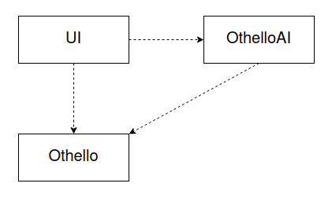

# Toteutusdokumentti

Othello-ratkaisijan toteutus jakautuu kolmeen luokkaan: UI, Othello ja OthelloAI.
Näiden lisäksi on tiedosto index.py, josta peli käynnistetään.

Käyttöliittymä sijaitsee luokassa UI, ja siellä tapahtuu kommunikointi käyttäjän kanssa
ja yleensäkin peliä pyörittävä silmukka. Käyttöliittymällä on riippuvuudet luokkaan Othello,
jonka funktioiden avulla othelloa pelataan, sekä luokkaan OthelloAI, josta haetaan tekoälyn siirto.

Luokassa Othello on pelin tarvitsemat toiminnot, 
kuten mahdollisten siirtojen hakeminen, siirron toteutus ja pelitilanteen laskeminen.
Othello-luokkaan annetaan parametrina pelilauta, ja tiettyyn othello-peliin liittyy luokkamuuttujana aina tietty pelilauta.

OthelloAI on minimax-tekoälyn toteuttava luokka. Se käyttää luokan Othello toimintoja.
Sovelluksessa tekoäly pelaa valkoista, joka on tekstikäyttöliittymässä "o" ja pelin sisäisessä logiikassa 2.

Sovelluksessa yksikkötestataan luokkia Othello ja OthelloAI.
Testit hyödyntävät luokkaa PelilautaStub, jossa on erilaisia pelilautoja tilanteiden tutkimiseksi.

Minimaxin aikavaativuus on alfa-beeta-karsinnasta huolimatta eksponentiaalinen suhteessa laskennan syvyyteen.
Algoritmia on kuitenkin tehostettu eri keinoin, erityisesti siirtoja järjestämällä.
Mitä aiemmin onnistutaan kohtaamaan paras siirto mahdollisten siirtojen joukosta,
sitä enemmän alfa-beeta-karsii läpi käytäviä pelipuun haaroja.
Lisäksi tehokkailla koodaustekniikoilla on merkitystä.

Läpikäytävät siirrot järjestetään ensin valitse_siirto-funktiossa, josta kutsutaan minimaxia.
Ne siirrot asetetaan ensimmäiseksi, joiden jälkeen vastustajalla on vähiten mahdollisia siirtoja.
Valitse_siirrossa on myös iteratiivinen syveneminen, joka tarkoittaa sitä, että peliä ei lasketa jollekin kiinteälle syvyydelle,
vaan niin pitkälle, kuin annetussa aikarajassa ehditään. Tämä tuo joustavuutta laskentasyvyyteen,
mutta siitä saadaan myös hyötyä siirtojen järjestämiseen, 
sillä edellisen iteraation paras siirto asetetaan seuraavan kierroksen ensimmäiseksi läpikäytäväksi siirroksi.
Minimaxissa puolestaan on transpositiotaulu, johon talletetaan tietyssä pelitilanteessa tieto,
mikä siirto tuotti parhaan tuloksen.
Mikäli sama pelitilanne kohdataan uudelleen, asetetaan kyseinen siirto läpikäytävien siirtojen ensimmäiseksi.
Transpositiotaulu on voimassa aina yhden tekoälyn siirron valinnan ajan.

Koska laskentasyvyys on oleellinen tekijä tekoälyn hyvyydessä, työtä voisi parantaa optimoimalla koodia lisää.
Esimerkiksi siirron peruutus tai numpy.arrayn käyttöönotto saattaisivat tehostaa laskentaa.
Toisaalta pelkästään nykyisen 2-ulotteisen listan muuttaminen numpy.arrayksi ja deepcopyn vaihtaminen tätä vastaavaksi copyksi
heikensivät tulosta toteutetussa testisarjassa, joten numpy.array ei automaattisesti tuo lisähyötyä.
Tehostaminen riippuu siitä, pystytäänkö hyödyntämään numpy.arrayn omia, tehokkaita funktioita.

Toinen tekoälyn hyvyyttä parantava asia on toimiva heuristinen arviointi,
joten siihen voisi panostaa enemmän. Nykyinen heuristiikka perustuu siihen, että jokaisella pelilaudan ruudulla on tietty paino, joka kertoo siirron hyvyyden.
Heuristiikka ei kuitenkaan huomioi esimerkiksi sitä, mikä pelinappula jonkin ruudun vieressä on, vaikka myös tällä on merkitystä.

Ohjelmakoodia voisi refaktoroida siten, että pelilaudan muokkaaminen tapahtuu parametrin välityksellä sen sijaan, että se on luokkamuuttujana.
Tämä olisi ehkä logiikaltaan järkevämpää.

## Lähteet

[Minimax-pelit](https://tiralabra.github.io/2023_p3/fi/aiheet/minimax.pdf)
